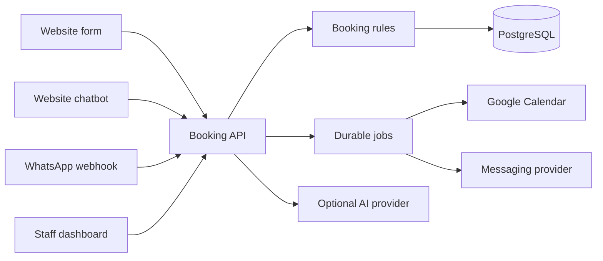
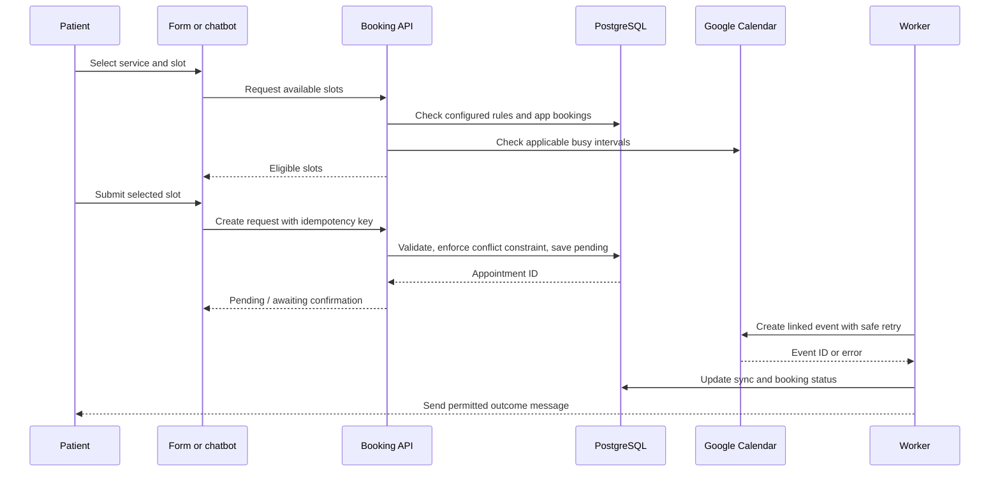

# Business Requirements Document: Clinic Booking Platform

**Version:** Draft 0.1  
**Date:** 26 September 2026  
**Status:** For validation with a pilot clinic  
**Initial market:** Independent clinic in Bengaluru, India

## 1. Executive summary

Build a configurable appointment-booking platform for one clinic, then reuse the same application for other clinics and appointment-based businesses. Patients can request appointments through a website form, website chatbot, or official WhatsApp chatbot. All channels share one booking engine, staff dashboard, application database, and integration with a Google Calendar authorized by the clinic owner.

The recommended MVP is a React/TypeScript frontend, a Node.js/TypeScript modular-monolith backend, and PostgreSQL. Begin with guided chatbot flows and clinic-approved FAQs; introduce an LLM only if the pilot shows a clear need. The application database is the system of record; Google Calendar is an external scheduling integration.

### Top five risks

| Risk | Impact | Initial mitigation |
|---|---|---|
| Owner's personal calendar contains private events | Privacy exposure or misleading availability | Query busy intervals only; consider a dedicated clinic calendar and optionally block time from the primary calendar |
| Database and calendar disagree | Missing or double bookings | Explicit synchronization states, reconciliation jobs, and staff alerts |
| WhatsApp onboarding or messaging costs delay launch | Pilot depends on an unavailable channel | Launch website form and chatbot first; enable official WhatsApp integration when ready |
| Google OAuth connection fails or is revoked | Calendar reads and writes stop | Monitor connection health; pause automatic confirmation; offer reconnect flow |
| Bot receives a clinical or urgent question | Unsafe or misleading answer | Approved administrative content only; immediate human handoff and clinic-approved escalation wording |

## 2. Business context and goals

### 2.1 Problem statement

The proposed customer is a small independent clinic whose staff may handle enquiries and appointments across several channels. Fragmented processes can make booking, follow-up, and schedule visibility difficult. The actual severity of this problem at the pilot clinic must be established through interviews and a baseline measurement; it is not assumed to be proven.

### 2.2 Stakeholders

| Stakeholder | Need |
|---|---|
| Clinic owner/manager | Reliable scheduling, visibility, controls, and evidence of value |
| Receptionist | A single queue of requests and manageable exceptions |
| Practitioner | Accurate schedule and control over availability |
| Patient | Clear slot choices, unambiguous status, and an easy way to change a booking |
| Platform operator | Repeatable onboarding, tenant separation, and support visibility |

### 2.3 Confirmed inputs versus assumptions

| Item | Definition | Status |
|---|---|---|
| Initial customer | One independent clinic in Bengaluru | Confirmed by brief |
| Intake channels | Website form, website chatbot, WhatsApp chatbot | Confirmed by brief |
| Calendar | Owner's personal Google account, authorized using OAuth | Confirmed by brief |
| Reuse | Configure later businesses without duplicating application code | Confirmed by brief |
| Booking policy | Immediate confirmation or staff approval | To validate with clinic |
| Practitioner scheduling | One or multiple practitioners and calendars | To validate with clinic |
| Commercial offer | Setup fee plus recurring software/support fee | Proposed for validation |

### 2.4 Goals and pilot KPIs

Set final thresholds with the clinic after measuring its current workflow. These proposed four-week criteria are illustrative pilot decision rules, not market benchmarks.

| Goal | Metric | Proposed pilot criterion |
|---|---|---|
| Capture enquiries | Eligible connected-channel enquiries recorded / eligible enquiries observed | At least 95% |
| Respond promptly | Median time to first useful automated response | Under 2 minutes |
| Prevent double-booking | Confirmed conflicts caused by the platform | Zero |
| Reduce staff effort | Staff minutes per booking before and during pilot | Agreed measurable reduction |
| Keep calendar synchronized | Confirmed bookings with linked calendar events | At least 99%, with all exceptions visible |
| Surface delivery outcomes | Confirmations delivered or flagged for staff | At least 99% accounted for |

**Continue** if clinic staff use and trust the product and the owner will pay to retain it. **Pause or pivot** if staff routinely fix availability, patients cannot complete the flow, or value does not justify operating cost.

## 3. Scope

### 3.1 MVP in scope

- One clinic, one location, configurable services, and one or more practitioners if justified by discovery.
- Clinic hours, holidays, appointment duration, buffers, minimum notice, cancellation policy, and administrative FAQs.
- Mobile-friendly website booking form and embedded website chatbot.
- Official WhatsApp inbound booking chatbot after business onboarding.
- Shared availability, booking, rescheduling, cancellation, and approval workflows.
- Google Calendar OAuth connection, busy-time checks, event creation/update/deletion, token refresh, reconnect, and reconciliation.
- Staff dashboard for requests, appointments, actions, and integration exceptions.
- Booking confirmations and optional reminders subject to patient choices, platform policies, and costs.
- Basic analytics by channel, booking status, response time, cancellations, and operational failures.

### 3.2 Out of scope

- Diagnosis, symptom triage, prescriptions, or treatment advice.
- Electronic health records, clinical documents, or ABDM integration.
- Payments, insurance, multi-location administration, and a full practice-management suite.
- An AI agent that changes appointments without deterministic booking validation.

## 4. Functional requirements

| ID | Priority | Requirement | Acceptance criterion |
|---|---|---|---|
| BR-01 | Must | Configure clinic services, hours, closures, buffers, timezone, and booking policy | Authorized owner can change permitted settings without redeploying code |
| BR-02 | Must | Use one availability service | Identical inputs yield identical eligible slots across channels |
| BR-03 | Must | Accept website-form requests | Valid request creates one appointment record and returns an explicit status |
| BR-04 | Must | Accept website-chatbot requests | Guided flow invokes the same booking API as the form |
| BR-05 | Must | Accept WhatsApp requests | Verified inbound webhook maps to the correct tenant and resumes safely |
| BR-06 | Must | Prevent conflicting appointments | Two concurrent requests cannot both confirm against single-capacity time |
| BR-07 | Must | Connect personal Google Calendar via OAuth | Owner can authorize, see health, and reconnect after failure |
| BR-08 | Must | Synchronize calendar events | Each confirmed appointment has a linked event or a visible sync exception |
| BR-09 | Must | Allow staff actions | Authorized staff can approve, reject, reschedule, or cancel and record a reason |
| BR-10 | Must | Answer administrative FAQs safely | Bot uses approved content and hands off clinical or uncertain questions |
| BR-11 | Must | Isolate tenants | Clinic A cannot access clinic B's patients, calendars, credentials, or configuration |
| BR-12 | Must | Track operational failures | Staff can see failed messages, calendar writes, and booking conflicts |
| BR-13 | Should | Send reminders | Messages follow clinic policy, patient choices, and channel rules |
| BR-14 | Should | Export basic pilot reporting | Owner can inspect enquiries, bookings, cancellations, and exceptions by channel |

## 5. Non-functional requirements

| Area | Draft pilot requirement |
|---|---|
| Usability | Mobile-first patient flows and staff-manageable exceptions |
| Performance | Slot search normally completes within 3 seconds; use a pending state if providers are slow |
| Reliability | Never represent an attempted calendar write as a confirmed success |
| Security | HTTPS, role-based access, encrypted integration tokens, secrets outside source control |
| Privacy | Minimum booking data; exclude medical histories from prompts, logs, and event descriptions |
| Observability | Request correlation IDs and alerts for OAuth, webhook, and calendar failures |
| Recovery | Automated database backups, documented restoration test, retryable jobs |
| Accessibility | Keyboard-operable form/chatbot, labelled fields, clear errors |
| Scalability | New tenants require configuration and credentials, not a code fork |

Privacy requirements must be reviewed against applicable Indian law and the clinic's own practices before processing real patient data; this document is not legal advice. Reference: [Digital Personal Data Protection Act, 2023](https://www.meity.gov.in/static/uploads/2024/06/2bf1f0e9f04e6fb4f8fef35e82c42aa5.pdf). Source checked 26 September 2026.

## 6. User journeys and booking states

### 6.1 Patient journeys

| Channel | Flow | Failure or handoff |
|---|---|---|
| Website form | Select service → choose slot → enter minimum contact details → review notice and communication choice → submit → receive status | If slot disappears, show fresh alternatives |
| Website chatbot | Ask to book → guided service and slot selection → confirm details → call shared API → show status | Clinical or uncertain question goes to clinic staff |
| WhatsApp chatbot | Patient messages business → approved options and available times → patient chooses → shared API records outcome | Unsupported request or message failure creates a staff task |

If staff approval is required, every channel must say **request received**, not **appointment confirmed**.

### 6.2 Staff journey

1. View incoming requests, upcoming appointments, and integration exceptions.
2. Approve, reject, reschedule, or cancel according to clinic policy.
3. Review messages or calendar events that failed to synchronize.
4. Update opening hours, closures, services, and approved FAQ content within role permissions.
5. Review pilot metrics weekly.

### 6.3 State machine

```text
ENQUIRY → PENDING_CONFIRMATION → CONFIRMED → COMPLETED
   │              │                  ├──→ RESCHEDULED → CONFIRMED
   │              └──→ REJECTED      ├──→ CANCELLED
   └──→ ABANDONED                    └──→ NO_SHOW
```

Calendar synchronization has a separate status: `pending`, `synced`, `failed`, or `conflict`. For the pilot, do not automatically confirm if calendar availability or event creation cannot be verified; instead, place the request in a staff queue, unless the clinic explicitly approves another policy.

### 6.4 Examples

- **Booking:** Patient selects a Tuesday evening slot; the system validates capacity and responds with either a confirmation or a clearly labelled request awaiting approval.
- **Rescheduling:** Staff or patient requests a new slot; the booking engine checks it before changing the appointment and calendar event.
- **Cancellation:** Authorized user cancels; the database changes state and a retryable job updates Google Calendar and sends any permitted notice.
- **Handoff:** Patient asks whether pain requires treatment; bot does not assess it and offers contact with clinic staff using clinic-approved wording.

## 7. Exception handling

| Case | Required behavior |
|---|---|
| Two patients select the same slot | Transaction-safe conflict check prevents double confirmation; loser sees new slots |
| Slot hold expires | Release hold; require new availability check before booking |
| Google Calendar unavailable | Do not auto-confirm; mark pending, retry, alert staff |
| Owner revokes OAuth or token fails | Mark connection unhealthy; disable automatic confirmation and show reconnect action |
| Staff does not respond | Escalate overdue pending requests according to clinic policy |
| Timezone or daylight-saving differences | Store UTC timestamps and explicit tenant timezone; render local time at edges |
| Duplicate WhatsApp webhook | Deduplicate by provider event ID and idempotency key |
| Message delivery fails | Show failure in dashboard and try a permitted alternative or staff follow-up |
| Patient sends free text | Route to approved intent flow or human handoff |
| Owner edits Google event manually | Reconciliation flags disagreement; avoid silently overwriting the change |

## 8. Calendar and WhatsApp integrations

### 8.1 Google Calendar for a personal account

- The calendar owner authorizes access using Google OAuth. Do not presume a service account can access their private calendar without appropriate authorization.
- Recommend a dedicated **Clinic Appointments** calendar inside the personal account. Confirm whether events from the primary personal calendar should also block availability.
- Request the least-privilege scopes compatible with free/busy checks and event operations; verify endpoint requirements before implementation.
- Store encrypted refresh-token material and the chosen calendar ID per tenant; provide health and reconnect UI.
- Read busy periods rather than exposing private event titles, descriptions, or attendees.
- Record the application's appointment ID, Google calendar ID, and Google event ID; retry using stable operation IDs and reconciliation to avoid duplicate events.
- Treat manual busy time as unavailable; flag manual edits to app-owned events rather than overwriting them silently.
- Cache reads briefly, but revalidate at booking time; back off when quota or transient errors occur.
- Review OAuth app publishing status before the live pilot: refresh tokens for external apps in Testing status can expire after seven days.

Official references, checked 26 September 2026: [Calendar scopes](https://developers.google.com/workspace/calendar/api/auth), [Calendar quotas](https://developers.google.com/workspace/calendar/api/guides/quota), [Google OAuth](https://developers.google.com/identity/protocols/oauth2), [event insertion](https://developers.google.com/workspace/calendar/api/v3/reference/events/insert).

Google documents API quotas and standard API use without additional cost; hosting and other providers may still charge. Verify current limits before deployment.

### 8.2 Official WhatsApp integration

- Use the official WhatsApp Business Platform or an authorized provider; do not automate WhatsApp Web.
- Verify webhook authenticity and deduplicate incoming provider IDs.
- Map each business sender to its tenant and keep sender credentials separate.
- Maintain conversation state and approved administrative message templates.
- Capture appropriate patient communication choices; review rules for service replies and outbound template messages.
- Track category-dependent message costs, provider markups, failures, and clinic-level usage.
- If onboarding is delayed, launch the website channels first.

Official references, checked 26 September 2026: [WhatsApp Business Platform pricing](https://whatsappbusiness.com/products/platform-pricing/) and [Meta template fundamentals](https://developers.facebook.com/documentation/business-messaging/whatsapp/templates/overview). Current rules and local rates must be verified before enabling reminders.

### 8.3 Bot safety

The chatbot may interpret administrative intent and answer from clinic-approved information. Booking decisions are validated by deterministic rules. It must not diagnose, recommend treatment, or autonomously decide clinical urgency. Route such requests to a person using clinic-approved messages.

## 9. Architecture and technical design

### 9.1 Recommended architecture

```text
Website form ───────┐
Website chatbot ────┼──> TypeScript Booking API ──> PostgreSQL
WhatsApp webhook ───┘          │                     │
Staff dashboard ───────────────┤                     └──> Retryable jobs
                               ├──> Google Calendar adapter
                               ├──> WhatsApp adapter
                               └──> Optional AI adapter
```





A Node.js/TypeScript modular monolith avoids maintaining two backend deployments during the pilot. Add a separate Python/FastAPI AI service only when necessary. n8n may assist with non-critical reports or notifications, but the booking engine and source-of-truth database must remain in the app.

### 9.2 Data model

Every patient-facing record has `tenant_id`. Apply tenant-scoped authorization to every operation; consider database row-level security as a second defense.

| Table | Main fields |
|---|---|
| `tenants` | ID, name, slug, timezone, status, branding |
| `staff_users` | ID, tenant ID, role, authentication subject |
| `services` | ID, tenant ID, name, duration, buffer, active |
| `resources` | ID, tenant ID, practitioner, capacity |
| `availability_rules` | Tenant ID, resource ID, weekday, hours, exceptions |
| `patients` | ID, tenant ID, contact details, notice/communication records |
| `appointments` | ID, tenant ID, patient ID, service ID, resource ID, start/end, status, version |
| `calendar_connections` | Tenant ID, resource ID, provider, calendar ID, encrypted token reference, health |
| `calendar_links` | Appointment ID, calendar event ID, sync status, error |
| `conversations` | Tenant ID, channel, external conversation ID, minimal state |
| `outbox_jobs` | Tenant ID, type, payload reference, attempts, next run, status |
| `audit_events` | Tenant ID, actor, action, object ID, timestamp |

Enforce a database-level no-overlap constraint or transaction-safe equivalent for single-capacity confirmed appointments; a unique constraint on slot start alone is insufficient when service durations differ. Design a separate allocation strategy if a service allows multiple simultaneous bookings.

### 9.3 Booking algorithm and reconciliation

1. Generate candidate slots from hours, closures, service duration, capacity, and buffers.
2. Subtract existing app bookings and applicable Google busy intervals.
3. At submission, start a transaction and enforce a database conflict constraint or lock the resource/time range.
4. Recheck local state and fresh calendar busy time; save a pending appointment and idempotency key.
5. Commit local state and enqueue a calendar-write job. Do not hold a database transaction open across a Google API request.
6. Write the event, save the event ID, and update synchronization state.
7. Confirm according to clinic policy only when required checks succeed. If an external result is uncertain, reconcile before retrying.
8. Periodically compare future app appointments with linked events and flag mismatches.

Database and Google Calendar cannot form one atomic transaction. The design uses pending states, idempotent jobs, and reconciliation rather than promising perfect simultaneous writes.

### 9.4 API surface

| Endpoint | Purpose |
|---|---|
| `GET /v1/public/:tenantSlug/services` | Public bookable services |
| `GET /v1/public/:tenantSlug/slots` | Eligible slot candidates |
| `POST /v1/public/:tenantSlug/appointments` | Create a booking request using an idempotency key |
| `POST /v1/public/:tenantSlug/chat/messages` | Website chatbot turn |
| `POST /v1/webhooks/whatsapp` | Verified inbound provider events |
| `GET /v1/admin/appointments` | Tenant-scoped staff view |
| `POST /v1/admin/appointments/:id/approve` | Approve a pending request |
| `POST /v1/admin/appointments/:id/reschedule` | Recheck and change slot |
| `POST /v1/admin/appointments/:id/cancel` | Cancel and queue integrations |
| `GET /v1/admin/calendar/connect` | Begin owner OAuth flow |
| `GET /v1/auth/google/callback` | Complete OAuth flow |
| `GET /health` | Health and dependency status |

Example create request:

```json
{
  "serviceId": "consultation",
  "resourceId": "practitioner-1",
  "startAt": "2026-09-29T12:30:00+05:30",
  "patient": {
    "name": "Example Patient",
    "phone": "+91XXXXXXXXXX"
  },
  "channel": "website_form",
  "communicationChoice": "booking_updates"
}
```

Response fields include `appointmentId`, `status`, `calendarSyncStatus`, and wording that clearly distinguishes **requested** from **confirmed**.

### 9.5 Suggested repository

```text
apps/
  web/                   # Patient pages, form, embedded chatbot
  admin/                 # Staff dashboard
  api/                   # API and background worker
packages/
  booking/               # Availability, rules, state machine
  tenant-config/         # Validated tenant settings
  integrations/
    calendar-google/
    whatsapp/
    ai/
  shared/                # Types and validation schemas
infra/
  migrations/
  deploy/
```

### 9.6 Deployment path

Use static frontend hosting, one backend service, and a managed PostgreSQL instance with backups. Select vendors and region after checking current free-tier limits, OAuth redirect-domain requirements, database sleep/retention behavior, support needs, and messaging costs. Keep separate development, staging, and production configurations; use environment-based secrets, reviewed migrations, CI/CD, health checks, logging, and rollback procedures. Scale later by adding workers, managed queueing, separate read workloads, and more robust tenant controls when usage warrants them—not by starting with Kubernetes.

### 9.7 Testing plan

- Unit tests for slot generation, buffers, timezones, state transitions, and permission checks.
- Integration tests for PostgreSQL constraints, OAuth token refresh, calendar adapters, and retries.
- End-to-end tests for form, website chatbot, and WhatsApp flows.
- Concurrent booking tests against one practitioner and overlapping durations.
- Webhook verification and duplicate-event replay tests.
- Manual tests for revoked OAuth, quota errors, edited calendar events, and provider outages.
- Tenant-isolation, secret exposure, log redaction, accessibility, backup, and restore tests.

## 10. Commercial model and cost planning

Propose a one-time onboarding/setup fee and an optional monthly software/support fee. Confirm willingness to pay during discovery; do not assume a specific price.

| Cost driver | Worksheet input |
|---|---|
| Frontend hosting | Chosen plan, bandwidth, domain |
| Backend hosting | Service size, uptime, outbound traffic |
| PostgreSQL | Storage, backups, retention, connections |
| WhatsApp | Delivered messages by category and market; any provider markup |
| AI, if used | Model calls and input/output usage |
| Monitoring and alternative notifications | Provider plan and actual volume |
| Founder support time | Monthly hours × target hourly cost |

**Monthly gross contribution = clinic subscription − recurring provider costs − allocated support cost.** Pricing, free tiers, quotas, and vendor policies must be rechecked against current official documentation before committing to a customer quote.

## 11. Delivery plan

Effort ranges are rough assumptions for one engineer, not delivery commitments.

| Phase | Rough effort | Deliverable | Exit test |
|---|---:|---|---|
| 0. Discovery | 2–3 engineer-days | Agreed clinic rules, baseline, privacy approach | Owner signs off |
| 1. Core booking | 7–10 days | Tenant config, slots, form, database constraints, dashboard | Conflict tests pass |
| 2. Calendar | 5–8 days | OAuth, event sync, reconnect, reconciliation | Failure and manual-edit tests pass |
| 3. Website chatbot | 3–5 days | Guided flow and approved FAQs | Same booking outcome as form |
| 4. WhatsApp | 5–10 days plus onboarding | Official webhook and conversation flow | Real-sender end-to-end test |
| 5. Pilot hardening | 5–8 days | Monitoring, backups, access review, training | Clinic-ready acceptance checklist |

### Pilot rollout

1. Interview owner and receptionist; observe bookings and establish a baseline.
2. Configure services and policies; test with fake patient records and a test calendar.
3. Have the owner authorize Google Calendar and decide whether personal busy events block slots.
4. Soft-launch form and website chatbot, initially with staff approval if schedules are inconsistent.
5. Enable WhatsApp after official onboarding and message review.
6. Review exceptions daily for the first two weeks and outcomes weekly for four weeks.
7. Decide whether to retain, change, or stop based on value and reliability.

## 12. Replication for clinic #2

Reuse the codebase, booking engine, tests, staff dashboard, and provider adapters. For each new clinic:

- Create a tenant and configure branding, domain, timezone, services, staff, hours, buffers, and policies.
- Configure approved FAQ content, communication notices, message templates, and retention settings.
- Have its owner authorize its own Google account and choose calendars.
- Connect its own WhatsApp business sender and verify webhook mapping.
- Test isolation, concurrent bookings, calendar recovery, message delivery, and staff permissions.
- Train staff and perform a controlled go-live.

Never copy OAuth tokens, WhatsApp credentials, patient data, or event IDs between tenants.

## 13. Questions for the pilot clinic

1. Which services may patients book online, and how long does each take?
2. Does each practitioner have a separate schedule or calendar?
3. Must a receptionist approve requests, or may the system confirm instantly?
4. What are opening hours, breaks, holidays, and booking cutoffs?
5. How much buffer is needed between appointments?
6. Can more than one patient book the same time for any service?
7. Which patient details are genuinely necessary at booking?
8. Which administrative questions may the bot answer without staff review?
9. How should medical and potentially urgent messages be handed off?
10. Should the owner's personal-calendar events block clinic slots?
11. Can the clinic use a dedicated calendar within the owner's personal account?
12. Who may view, edit, cancel, or export appointments?
13. What are the cancellation, rescheduling, and no-show policies?
14. Which WhatsApp messages are necessary, and what alternatives are acceptable?
15. What outcome would make the owner pay for the product after four weeks?

**Key decision before implementation:** Decide whether a selected slot is instantly confirmed or awaits staff approval. This determines patient wording, calendar-failure behavior, and the booking state machine.